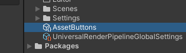
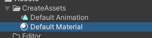
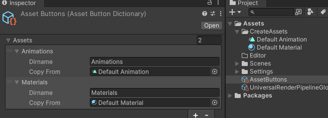
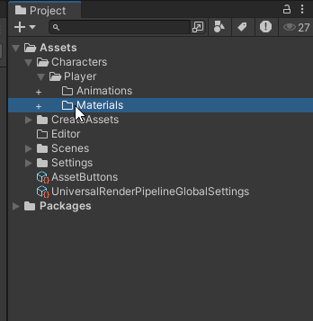

# Add Asset Button

プロジェクトビューにフォルダ名に応じたアセット追加ボタンを表示するシンプルなUnityEditor拡張です  

デザイナーがほっこり喜びます　多分


## 使い方

1. Unityプロジェクトの **Packages/manifest.json** に以下を追記
	```Json
	"com.odonata.add-asset-button": "https://github.com/odonataxyz/AddAssetButton.git"
	```

2. **AssetButtons.asset** というファイルがプロジェクト直下に生成されます  
	これはプロジェクト内であればどこに置いてもいいです  
	

3. アセット追加ボタンで追加するデフォルトアセットを作成しておきます  
	

4. **AssetButtons.asset** を編集します  
	Dirnameには対象とするフォルダ名、Copy Fromにはアセット複製元を指定します。  
	

5. これで対応するフォルダに[+]ボタンが追加されるので、ボタンを押すと対応するアセットが追加されます  
	


 [https://odonata.xyz/](https://odonata.xyz/)